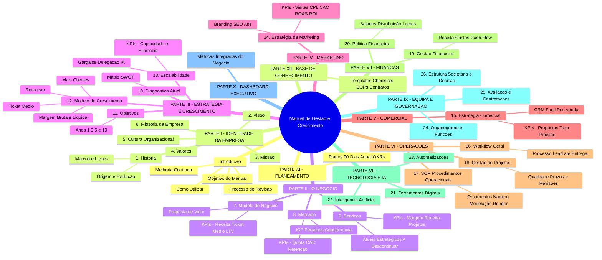

```mermaid
mindmap
  root((Manual de Gestao e Crescimento))
    Introducao
      Objetivo do Manual
      Como Utilizar
      Processo de Revisao
      Melhoria Continua
    PARTE I - IDENTIDADE DA EMPRESA
      1. Historia
        Origem e Evolucao
        Marcos e Licoes
      2. Visao
      3. Missao
      4. Valores
      5. Cultura Organizacional
      6. Filosofia da Empresa
    PARTE II - O NEGOCIO
      7. Modelo de Negocio
        Proposta de Valor
        KPIs - Receita Ticket Medio LTV
      8. Mercado
        ICP Personas Concorrencia
        KPIs - Quota CAC Retencao
      9. Servicos
        Atuais Estrategicos A Descontinuar
        KPIs - Margem Receita Projetos
    PARTE III - ESTRATEGIA E CRESCIMENTO
      10. Diagnostico Atual
        Matriz SWOT
      11. Objetivos
        Anos 1 3 5 e 10
      12. Modelo de Crescimento
        Mais Clientes
        Ticket Medio
        Retencao
        Margem Bruta e Liquida
      13. Escalabilidade
        Gargalos Delegacao IA
        KPIs - Capacidade e Eficiencia
    PARTE IV - MARKETING
      14. Estratégia de Marketing
        Branding SEO Ads
        KPIs - Visitas CPL CAC ROAS ROI
    PARTE V - COMERCIAL
      15. Estrategia Comercial
        CRM Funil Pos-venda
        KPIs - Propostas Taxa Pipeline
    PARTE VI - OPERACOES
      16. Workflow Geral
        Processo Lead ate Entrega
      17. SOP Procedimentos Operacionais
        Orcamentos Naming Modelação Render
      18. Gestao de Projetos
        Qualidade Prazos e Revisoes
    PARTE VII - FINANCAS
      19. Gestao Financeira
        Receita Custos Cash Flow
      20. Politica Financeira
        Salarios Distribuição Lucros
    PARTE VIII - TECNOLOGIA E IA
      21. Ferramentas Digitais
      22. Inteligencia Artificial
      23. Automatizacoes
    PARTE IX - EQUIPA E GOVERNACAO
      24. Organograma e Funcoes
      25. Avaliacao e Contratacoes
      26. Estrutura Societaria e Decisao
    PARTE X - DASHBOARD EXECUTIVO
      Metricas Integradas do Negocio
    PARTE XI - PLANEAMENTO
      Planos 90 Dias Anual OKRs
    PARTE XII - BASE DE CONHECIMENTO
      Templates Checklists SOPs Contratos
```
