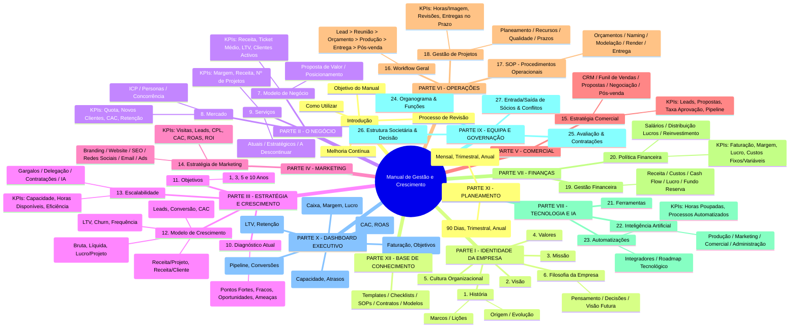

```mermaid
mindmap
  root((Manual de Gestão e Crescimento))
    Introdução
      Objetivo do Manual
      Como Utilizar
      Processo de Revisão
      Melhoria Contínua
    PARTE I - IDENTIDADE DA EMPRESA
      1. História
        Origem / Evolução
        Marcos / Lições
      2. Visão
      3. Missão
      4. Valores
      5. Cultura Organizacional
      6. Filosofia da Empresa
        Pensamento / Decisões / Visão Futura
    PARTE II - O NEGÓCIO
      7. Modelo de Negócio
        Proposta de Valor / Posicionamento
        KPIs: Receita, Ticket Médio, LTV, Clientes Activos
      8. Mercado
        ICP / Personas / Concorrência
        KPIs: Quota, Novos Clientes, CAC, Retenção
      9. Serviços
        Atuais / Estratégicos / A Descontinuar
        KPIs: Margem, Receita, Nº de Projetos
    PARTE III - ESTRATÉGIA E CRESCIMENTO
      10. Diagnóstico Atual
        SWOT (Pontos Fortes, Fracos, Oportunidades, Ameaças)
      11. Objetivos
        1, 3, 5 e 10 Anos
      12. Modelo de Crescimento
        Mais Clientes (Leads, Conversão, CAC)
        Ticket Médio (Receita/Projeto, Receita/Cliente)
        Retenção (LTV, Churn, Frequência)
        Margem (Bruta, Líquida, Lucro/Projeto)
      13. Escalabilidade
        Gargalos / Delegação / Contratações / IA
        KPIs: Capacidade, Horas Disponíveis, Eficiência
    PARTE IV - MARKETING
      14. Estratégia de Marketing
        Branding / Website / SEO / Redes Sociais / Email / Ads
        KPIs: Visitas, Leads, CPL, CAC, ROAS, ROI
    PARTE V - COMERCIAL
      15. Estratégia Comercial
        CRM / Funil de Vendas / Propostas / Negociação / Pós-venda
        KPIs: Leads, Propostas, Taxa Aprovação, Pipeline
    PARTE VI - OPERAÇÕES
      16. Workflow Geral
        Lead > Reunião > Orçamento > Produção > Entrega > Pós-venda
      17. SOP - Procedimentos Operacionais
        Orçamentos / Naming / Modelação / Render / Entrega
      18. Gestão de Projetos
        Planeamento / Recursos / Qualidade / Prazos
        KPIs: Horas/Imagem, Revisões, Entregas no Prazo
    PARTE VII - FINANÇAS
      19. Gestão Financeira
        Receita / Custos / Cash Flow / Lucro / Fundo Reserva
      20. Política Financeira
        Salários / Distribuição Lucros / Reinvestimento
        KPIs: Faturação, Margem, Lucro, Custos Fixos/Variáveis
    PARTE VIII - TECNOLOGIA E IA
      21. Ferramentas
      22. Inteligência Artificial
        Produção / Marketing / Comercial / Administração
      23. Automatizações
        Integradores / Roadmap Tecnológico
        KPIs: Horas Poupadas, Processos Automatizados
    PARTE IX - EQUIPA E GOVERNAÇÃO
      24. Organograma & Funções
      25. Avaliação & Contratações
      26. Estrutura Societária & Decisão
      27. Entrada/Saída de Sócios & Conflitos
    PARTE X - DASHBOARD EXECUTIVO
      Crescimento (Faturação, Objetivos)
      Comercial (Pipeline, Conversões)
      Marketing (CAC, ROAS)
      Produção (Capacidade, Atrasos)
      Financeiro (Caixa, Margem, Lucro)
      Clientes (LTV, Retenção)
    PARTE XI - PLANEAMENTO
      Planos (90 Dias, Trimestral, Anual)
      OKRs & Revisões (Mensal, Trimestral, Anual)
    PARTE XII - BASE DE CONHECIMENTO
      Templates / Checklists / SOPs / Contratos / Modelos
```
