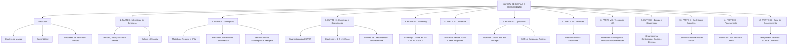

```mermaid
flowchart TD
    ROOT["MANUAL DE GESTAO E CRESCIMENTO"]

    ROOT --> INTRO["Introducao"]
    INTRO --> I1["Objetivo do Manual"]
    INTRO --> I2["Como Utilizar"]
    INTRO --> I3["Processo de Revisao e Melhoria"]

    ROOT --> P1["1. PARTE I - Identidade da Empresa"]
    P1 --> P1_A["Historia, Visao, Missao e Valores"]
    P1 --> P1_B["Cultura e Filosofia"]

    ROOT --> P2["2. PARTE II - O Negocio"]
    P2 --> P2_A["Modelo de Negocio e KPIs"]
    P2 --> P2_B["Mercado ICP Personas Concorrencia"]
    P2 --> P2_C["Servicos Atuais Estrategicos e Margens"]

    ROOT --> P3["3. PARTE III - Estrategia e Crescimento"]
    P3 --> P3_A["Diagnostico Atual SWOT"]
    P3 --> P3_B["Objetivos 1, 3, 5 e 10 Anos"]
    P3 --> P3_C["Modelo de Crescimento e Escalabilidade"]

    ROOT --> P4["4. PARTE IV - Marketing"]
    P4 --> P4_A["Estrategia Canais e KPIs CAC ROAS ROI"]

    ROOT --> P5["5. PARTE V - Comercial"]
    P5 --> P5_A["Processo Vendas Funil CRM e Propostas"]

    ROOT --> P6["6. PARTE VI - Operacoes"]
    P6 --> P6_A["Workflow Geral Lead ate Entrega"]
    P6 --> P6_B["SOPs e Gestao de Projetos"]

    ROOT --> P7["7. PARTE VII - Financas"]
    P7 --> P7_A["Gestao e Politica Financeira"]

    ROOT --> P8["8. PARTE VIII - Tecnologia e IA"]
    P8 --> P8_A["Ferramentas Inteligencia Artificial e Automatizacoes"]

    ROOT --> P9["9. PARTE IX - Equipa e Governacao"]
    P9 --> P9_A["Organograma Contratacoes Socios e Decisao"]

    ROOT --> P10["10. PARTE X - Dashboard Executivo"]
    P10 --> P10_A["Consolidacao de KPIs de Gestao"]

    ROOT --> P11["11. PARTE XI - Planeamento"]
    P11 --> P11_A["Planos 90 Dias Anuais e OKRs"]

    ROOT --> P12["12. PARTE XII - Base de Conhecimento"]
    P12 --> P12_A["Templates Checklists SOPs e Contratos"]
```
