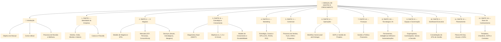

```mermaid
%%{init: {
  'theme': 'base',
  'themeVariables': {
    'fontSize': '20px',
    'fontFamily': 'arial',
    'nodePadding': 20
  },
  'flowchart': {
    'nodeSpacing': 50,
    'rankSpacing': 80,
    'curve': 'basis'
  }
}}%%
flowchart TD
    ROOT["📘 MANUAL DE GESTÃO E CRESCIMENTO"]

    ROOT --> INTRO["🎯 Introdução"]
    INTRO --> I1["Objetivo do Manual"]
    INTRO --> I2["Como Utilizar"]
    INTRO --> I3["Processo de Revisão e Melhoria"]

    ROOT --> P1["1. PARTE I — Identidade da Empresa"]
    P1 --> P1_A["História, Visão, Missão e Valores"]
    P1 --> P1_B["Cultura e Filosofia"]

    ROOT --> P2["2. PARTE II — O Negócio"]
    P2 --> P2_A["Modelo de Negócio e KPIs"]
    P2 --> P2_B["Mercado (ICP, Personas, Concorrência)"]
    P2 --> P2_C["Serviços (Atuais, Estratégicos, Margens)"]

    ROOT --> P3["3. PARTE III — Estratégia e Crescimento"]
    P3 --> P3_A["Diagnóstico Atual (SWOT)"]
    P3 --> P3_B["Objetivos (1, 3, 5 e 10 Anos)"]
    P3 --> P3_C["Modelo de Crescimento e Escalabilidade"]

    ROOT --> P4["4. PARTE IV — Marketing"]
    P4 --> P4_A["Estratégia, Canais e KPIs (CAC, ROAS, ROI)"]

    ROOT --> P5["5. PARTE V — Comercial"]
    P5 --> P5_A["Processo de Vendas, Funil, CRM e Propostas"]

    ROOT --> P6["6. PARTE VI — Operações"]
    P6 --> P6_A["Workflow Geral (Lead até Entrega)"]
    P6 --> P6_B["SOPs e Gestão de Projetos"]

    ROOT --> P7["7. PARTE VII — Finanças"]
    P7 --> P7_A["Gestão e Política Financeira"]

    ROOT --> P8["8. PARTE VIII — Tecnologia e IA"]
    P8 --> P8_A["Ferramentas, Inteligência Artificial e Automatizações"]

    ROOT --> P9["9. PARTE IX — Equipa e Governação"]
    P9 --> P9_A["Organograma, Contratações, Sócios e Decisão"]

    ROOT --> P10["10. PARTE X — Dashboard Executivo"]
    P10 --> P10_A["Consolidação de KPIs de Gestão"]

    ROOT --> P11["11. PARTE XI — Planeamento"]
    P11 --> P11_A["Planos 90 Dias, Anuais e OKRs"]

    ROOT --> P12["12. PARTE XII — Base de Conhecimento"]
    P12 --> P12_A["Templates, Checklists, SOPs e Contratos"]
```
